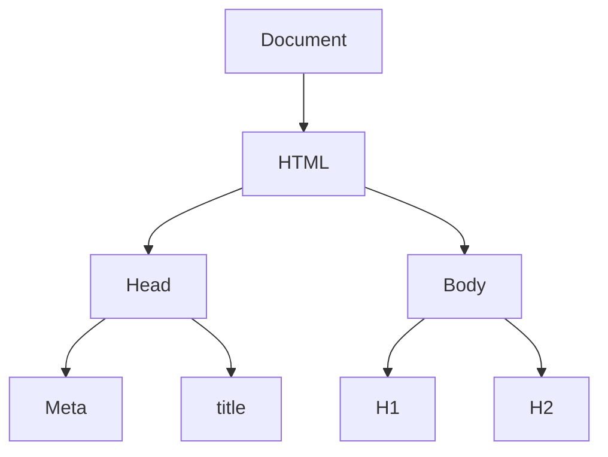

# DOM (Document Object Model)

| Contents |
| :--- |
| [What is DOM?](#what-is-dom) |
| [Nodes & Elements - Querying the DOM Overview](#nodes--elements---querying-the-dom-overview) |
| [Exploring and Changing DOM Properties](#exploring-and-changing-dom-properties)|
| [Attributes & Properties](#attributes--properties) |
| [Traversing the DOM](#traversing-the-dom) |
| [Styling DOM Elements](#styling-dom-elements) |
| [Creating & Inserting Elements with JS](#creating--inserting-elements-with-js) |
| [Cloning DOM nodes](#cloning-dom-nodes) |
| [Live Node Lists vs Static Node Lists](#live-node-lists-vs-static-node-lists) |
| [Removing Elements](#removing-elements) |
| [Summary -  Insert, Replace & Removal](#summary---insert-replace--removal) |

&nbsp;

:abacus: [Understand with Code](summary-with-code/)

:notebook_with_decorative_cover: [Projects](projects/)

## [What is DOM?](https://drive.google.com/uc?export=view&id=1LA_Qnlb6kL8Pn2HmOCtspLT4xBAUyOm-)

The Document Object Model (DOM) is a programming interface for HTML(HyperText Markup Language) and XML(Extensible markup language) documents. It defines the logical structure of documents and the way a document is accessed and manipulated.

> Note: It is called a Logical structure because DOM doesn’t specify any relationship between objects.

DOM is a way to represent the webpage in a structured hierarchical way so that it will become easier for programmers and users to glide through the document. With DOM, we can easily access and manipulate tags, IDs, classes, Attributes, or Elements of HTML using commands or methods provided by the Document object. Using DOM, the JavaScript gets access to HTML as well as CSS of the web page and can also add behavior to the HTML elements. So, basically, ***Document Object Model is an API that represents and interacts with HTML or XML documents.***

> Note: Although the DOM is language agnostic, or created to be independent from a particular programming language, throughout this resource we will focus on and refer to JavaScript’s implementation of the HTML DOM.

### Why DOM is required?

HTML is used to structure the web pages and Javascript is used to add behavior to our web pages. When an HTML file is loaded into the browser, the javascript can not understand the HTML document directly. So, a corresponding document is created(DOM). ***DOM is basically the representation of the same HTML document but in a different format with the use of objects.*** Javascript interprets DOM easily i.e javascript can not understand the tags(`<h1>H</h1>`) in HTML document but can understand object `h1` in DOM. Now, Javascript can access each of the objects (`h1`, `p`, etc) by using different functions.

### Structure of DOM

DOM can be thought of as a Tree or Forest(more than one tree). The term structure model is sometimes used to describe the tree-like representation of a document. Each branch of the tree ends in a node, and each node contains objects. Event listeners can be added to nodes and triggered on an occurrence of a given event. One important property of DOM structure models is **structural isomorphism** - if any two DOM implementations are used to create a representation of the same document, they will create the same structure model, with precisely the same objects and relationships.

Let's take a look at this HTML code to better understand the DOM tree structure.

```html
<!DOCTYPE html>
<html lang="en">
  <head>
    <meta charset="UTF-8">
    <meta name="viewport" content="width=device-width, initial-scale=1.0">
    <meta http-equiv="X-UA-Compatible" content="ie=edge">
    <title>DOM tree structure</title>
  </head>
  <body>
    <h1>DOM tree structure</h1>
	<h2>Learn about the DOM</h2>
  </body>
</html>
```

Our document is called the root node and contains one child node which is the `<html>` element. The `<html>` element contains two children which are the `<head>` and `<body>` elements.

Both the `<head>` and `<body>` elements have children of their own.

Here is another way to visualize this tree of nodes.



### Properties of DOM

Here are some of the most important properties of the DOM:

1. **Window Object**: It is a global object that represents the browser window or tab that a web page is displayed in. It is the top-level object in the JavaScript object hierarchy, and provides a number of properties and methods that allow you to interact with the browser and the web page.

    The window object is automatically created when a web page is loaded in the browser, and is accessible from any JavaScript code that is executed in the page. Some of the most commonly used properties and methods of the window object include:

    - **`document`**: This property contains a reference to the Document object that represents the web page itself, and provides methods and properties for accessing and manipulating the content of the page.

    - **`location`**: This property contains a reference to the Location object that represents the current URL of the web page, and provides methods and properties for navigating to other pages and manipulating the browser history.

    - **`console`**: This property contains a reference to the Console object that provides methods for logging messages and debugging JavaScript code in the browser console.

    - **`setTimeout()` and `setInterval()`**: These methods allow you to schedule code to be executed after a specified delay or at regular intervals, respectively.

    - **`alert()`, `confirm()`, and `prompt()`**: These methods provide simple user interface elements for displaying messages, getting confirmation from the user, and getting input from the user, respectively.

    In addition to these, the window object provides many other properties and methods for interacting with the browser and the web page, such as `history`, `screen`, `navigator`, and `localStorage`.

2. **Document**: This is the top-level node in the DOM tree, which represents the entire HTML or XML document. It has properties such as title, URL, doctype, head, and body, which can be used to access and manipulate different parts of the document.

3. **Element**: This represents an HTML or XML element in the document, such as `<div>`, `<p>`, or ``. It has properties such as `tagName`, `id`, `className`, `innerHTML`, `textContent`, `attributes`, and so on, which can be used to access and manipulate its content and attributes.

4. **Attribute**: This represents an attribute of an HTML or XML element, such as `id`, `class`, `src`, or `href`. It has properties such as `name`, `value`, and `specified`, which can be used to access and manipulate its value and status.

5. **Text**: This represents a text node in the document, which contains plain text that appears between HTML or XML tags. It has properties such as `nodeValue`, `textContent`, and `data`, which can be used to access and manipulate its content.

6. **NodeList**: This represents a list of nodes that can be accessed by index or by iteration. It is often used to represent a collection of elements that share a common tag name, class, or other attribute.

7. **Event**: This represents an event that occurs in the document, such as a click, a keypress, or a load. It has properties such as `type`, `target`, `currentTarget`, `preventDefault()`, and `stopPropagation()`, which can be used to handle and control the event.

### What DOM is not?

- The Document Object Model is not a binary description where it does not define any binary source code in its interfaces.

- The Document Object Model is not used to describe objects in XML or HTML whereas the DOM describes XML and HTML documents as objects.

- The Document Object Model is not represented by a set of data structures; it is an interface that specifies object representation.

- The Document Object Model does not show the criticality of objects in documents i.e it doesn’t have information about which object in the document is appropriate to the context and which is not.

Readings:

- [Introduction to the DOM](https://developer.mozilla.org/en-US/docs/Web/API/Document_Object_Model/Introduction)

- [DOM (Document Object Model)](https://www.geeksforgeeks.org/dom-document-object-model/)

- [What Is DOM?](https://www.codecademy.com/resources/blog/what-is-dom/)

- [The DOM in 4 minutes](https://www.youtube.com/watch?v=KShnPYN-voI)

## [Nodes & Elements - Querying the DOM Overview](https://drive.google.com/uc?export=view&id=18AvPJqfh735NjSLnXPHRTZKvdVEzZhbB)

To understand in lengths, follow articles mentioned in reading sections.

Here's a summary of the various methods you got to reach out to DOM elements (note: you can only query for element nodes).

Besides the below query methods, you also got these ***special properties*** on the document object to select parts of the document:

`document.body` => Selects the `<body>` element node.

`document.head` => Selects the `<head>` element node.

`document.documentElement` => Selects the `<html>` element node.

[**Query Methods**](https://drive.google.com/uc?export=view&id=1wWMriEA76ov4cd-gbn9uFmrAxOPurcky)

```javascript
document.querySelector(<CSS selector>);
```

Takes any CSS selector (e.g. `'#some-id'`, `'.some-class'` or `'div p.some-class'`) and returns the first (!) matching element in the DOM. Returns `null` if no matching element could be found.

More information: https://developer.mozilla.org/en-US/docs/Web/API/Document/querySelector

```javascript
document.getElementById(<ID>);
```

Takes an ID (without `#`, just the id name) and returns the element that has this id. Since the same ID shouldn't occur more than once on your page, it'll always return exactly that one element. Returns `null` if no element with the specified ID could be found.

More information: https://developer.mozilla.org/en-US/docs/Web/API/Document/getElementById

```javascript
document.querySelectorAll(<CSS selector>);
```

Takes any CSS selector (e.g. `'#some-id'`, `'.some-class'` or `'div p.some-class'`) and returns all matching elements in the DOM as a static (non-live) `NodeList`. Returns and empty `NodeList` if no matching element could be found.

More information: https://developer.mozilla.org/en-US/docs/Web/API/Document/querySelectorAll

```javascript
document.getElementsByClassName(<CSS CLASS>);
```

Takes a CSS class g (e.g. `'some-class'`) and returns a live `HTMLCollection` of matched elements in your DOM. Returns an empty `HTMLCollection` if not matching elements were found.

More information: https://developer.mozilla.org/en-US/docs/Web/API/Document/getElementsByClassName

```javascript
document.getElementsByTagName(<HTML TAG>);
```

Takes an HTML tag (e.g. `'p'`) and returns a live `HTMLCollection` of matched elements in your DOM. Returns an empty `HTMLCollection` if not matching elements were found.

More information: https://developer.mozilla.org/en-US/docs/Web/API/Element/getElementsByTagName

There also is the `getElementsByName()` method which really isn't used commonly (https://developer.mozilla.org/en-US/docs/Web/API/Document/getElementsByName).

Readings:

- [Difference between Node object and Element object? - StackOverflow](https://stackoverflow.com/questions/9979172/difference-between-node-object-and-element-object#:~:text=So%2C%20in%20a%20nutshell%2C%20a,and%20a%20nextSibling%20and%20previousSibling.)

- [What's the Difference between DOM Node and Element?](https://dmitripavlutin.com/dom-node-element/)

- [JavaScript Node Vs Element](https://blog.webdevsimplified.com/2021-05/node-vs-element/)

## [Exploring and Changing DOM Properties](https://drive.google.com/uc?export=view&id=1NzniXKnhnwOsNwrJrboLLkVUmhvq9gzs)

Let's take an example and understand,

```html
<p id="welcome-text" class="text-default">Welcome!</p>
```

We have a paragraph with ID and class assigned to it and we select it by using it's ID.

```javascript
const para = document.getElementById("welcome-text");
```

**Read Operations** 

`para.textContent` => With this, we can read the content of paragraph tag. In this case, it's output would be "Welcome!".

`para.id` => With this, we can read the id of paragraph tag. In this case, it's output would be "welcome-text".

`para.className` => With this, we can read the class name of paragraph tag. In this case, it's output would be "text-default".

**Write Operation**

Suppose, in this example, if you want to modify the class name, it can be done like below. ***However, please note that not all properties of an element are writable.***

```javascript
para.className = "new-class";
```
once done, this will be reflected back in the DOM which the browser rendered and will of course be updated on the UI totally automatic by the browser.

> Note - To view all the properties of an element, you can use `console.dir(<element>);`. Or find that element in official MDN documents and look `DOM Interface` for it. It will give us all the properties and methods associated with it.

For styling, you can utilize `style` property followed by CSS property. For example,

```javascript
console.log(p.style.backgroundColor); // ""
p.style.backgroundColor = "red";
console.log(p.style.backgroundColor); // red
```

You see, in above example, we have used CSS property `background-color`. But it is written as `backgroundColor`. Actually, to make this work in JS, all CSS property with dashes(-) in it, written in a camel case, where dashes are removed and letter following dash should written in uppercase.

## [Attributes & Properties](https://drive.google.com/uc?export=view&id=1AUFv5KTjxqIMdq-BbRhUhb0i5cIO8kT0)

Let's summarize what we've discussed so far and it will help to identify the differences between HTML attributes & DOM property.

- Attribute is related to HTML and Property is related to DOM.

- There is no 'HTML property' only 'HTML Attribute'. Similarly there is no 'DOM Attribute' only 'DOM Property'.

- When the browser reads your HTML, it converts the HTML attributes to DOM properties.

- Often the html attributes and DOM properties have the same names. For example, in `<input id="message"/>`, `id` is a html attribute.

- When the browser parses the `<input id="message"/>`, it creates a DOM object like this, `input.id = "message"`. Here `id` is the property of the DOM object `input`.

- In the above case the name `id` is the same for both HTML attribute and DOM property. But it is not always one to one.

### Different Attribute to Property mapping

For example , consider this html element, `<td colspan="2"></td>`. The html element `<td>` has the attribute `colspan`. But when the browser parses the above html element and creates the corresponding DOM object the property names changes from `colspan` to `colSpan`(camel case).

```javascript
td.colSpan = "2";
```

Attribute and property names are different!

> So when Angular refers to Property Binding, it refers to changing the DOM property values and not the attribute values.

### Attribute changes reflected in DOM Property

When you change the value of a HTML attribute, will the corresponding DOM property also gets changed and vice versa?

Not always! Here, let's see the example where it does.

For example,

```html
<input id="message">
<script>
  const input = document.getElementById("message");
  input.setAttribute("id","updatedmessage");

  alert(input.getAttribute("id");  // accessing HTML attribute; Output - "updatedmessage"
  alert(input.id); // accessing DOM property; Output - "updatedmessage"
</script>
```

`input.getAttribute(“id”)` is used to access the HTML attribute of the input element.

`input.id` is used to access the DOM property of the input element.

In this case, on changing the attribute using the method `setAttribute()`, the value gets reflected in the DOM property as well.

And if you change the `id` DOM property first and get the value of the attribute, it gets changed as well.

```html
<script>
// continued...
  input.id ="dommessage";
  alert(input.getAttribute("id")); // Output - dommessage
</script>
```

The above code alerts the attribute `id` value as `“dommessage”` which is updated by changing the DOM property `id`.

### DOM property changes not getting reflected in HTML Attribute

Now consider another scenario, if you change the attribute `value` of an `input` element does the DOM property `value` also gets changed?

The answer is ***Yes!***

But if you change the DOM property `value` does it get reflected in the attribute `value`?

***No!***

It works only one way for the attribute `value`.

> Attribute to Property ---> Works!
>
> Property to Attribute ---> Doesn’t work!

Let’s see it through an example:

```html
<input id="message" value="Hello World"/>

<script>
  const input = document.getElementById("message");
  input.setAttribute("value","Hello this is changed through attribute!");

  alert(input.getAttribute("value");  // Accessing HTML attribute; Output - "Hello this is changed through attribute!"
  alert(input.value); // Accessing DOM property; Output - "Hello this is changed through attribute!"
</script>
```

In this case, both `alert` statements alert the value “Hello this is changed through attribute!”

This is because if you change the attribute value it gets reflected in the DOM property value. But the reverse doesn’t work.

```html
<script>
// continued...

  input.value="Hello this is changed through DOM property";

  alert(input.getAttribute("value")); // Output - "Hello this is changed through attribute!"
</script>
```

Though the value property is changed , the `alert` still alerts the value “Hello this is changed through attribute!” as the change doesn’t get propagated from DOM property to HTML attribute.

### Other Differences

- HTML attributes are not case sensitive, the attribute `value` is the same as `Value` whereas DOM properties are case sensitive, the property `value` is different from `Value`.

- HTML attributes are always strings, DOM properties can have different data types. For example, the property `input.style` is an object whereas the attribute `input.getAttribute(“style”)` is a string.

- All attributes starting with `data-` (non standard attributes – created by user) are mapped to the DOM property `dataset`. These attributes are reserved for programmer’s use (To prevent user defined html attributes from colliding with standard html attributes).

    For example the attributes in `<input id="message" data-myvalue="My custom attribute">` can be accessed using the below DOM property.

    ```javascript
    const input = document.getElementById("message");
    alert(input.dataset.myvalue); // alerts "My custom attribute"
    ```

    The attribute `data-value` is converted to a DOM property by prefixing the keyword `dataset` and removing the word `data` from the attribute.

Readings:

- [Attribute vs Property in HTML](https://fullstackdeveloper.guru/2021/12/04/attribute-vs-property-in-html/)

- [Attributes and properties](https://javascript.info/dom-attributes-and-properties)

## [Traversing the DOM](https://drive.google.com/uc?export=view&id=1TLOJllMYnnScq6wOFSVxcv-7lw9pIQ1v)

Often, you will want to move through the DOM without specifying each and every element beforehand. Learning how to navigate up and down the DOM tree and move from branch to branch is essential to understanding how to work with JavaScript and HTML.

To begin, we will create a new file called `test.html` comprised of the following code.

```html
<!DOCTYPE html>
<html lang="en">
<head>
	<meta charset="UTF-8">
	<meta name="viewport" content="width=device-width, initial-scale=1.0">
	<meta http-equiv="X-UA-Compatible" content="ie=edge">
	<title>DOM Traversal</title>
	<script src="app.js" defer></script>
</head>
<body>
	<header>
		<h1 id="main-title">
			Traversing the DOM!
		</h1>
  </header>
  <ul>
    <li class="list-item">Item 1</li>
    <li class="list-item">Item 2</li>
    <li class="list-item">Item 3</li>
  </ul>
  <input type="text" value="default text">
</body>
</html>
```

When we load the file in a web browser, we’ll see rendering that looks like the following screenshot.


### Root Nodes

The `document` object is the root of every node in the DOM. This object is actually a property of the `window` object, which is the global, top-level object representing a tab in the browser. The `window` object has access to such information as the toolbar, height and width of the window, prompts, and alerts. The `document` consists of what is inside of the inner `window`.

Below is the table of root elements that every document will contain. Even if a blank HTML file is loaded into a browser, these three nodes will be added and parsed into the DOM.

| Property | Node | Node Type |
| :--- | :--- | :--- |
| `document` | `#document` | `DOCUMENT_NODE` |
| `document.documentElement` | `html` | `ELEMENT_NODE` |
| `document.head` | `head` | `ELEMENT_NODE` |
| `document.body` | `body` | `ELEMENT_NODE` |

Since the `html`, `head`, and `body` elements are so common, they have their own properties on the `document`.

### Parent Nodes

The nodes in the DOM are referred to as parents, children, and siblings, depending on their relation to other nodes. The parent of any node is the node that is one level above it, or closer to the document in the DOM hierarchy. There are 3 properties to get the parent — `parentNode`, `parentElement` & `closest()`.

In our `test.html` example:

- `html` is the parent of `head` & `body`.
- `body` is the parent of `header`, `ul` & `input` but not the `h1` & `li` since both are 2 levels down from `body`.

1. [`parentNode`](https://developer.mozilla.org/en-US/docs/Web/API/Node/parentNode) - It is used to return the parent node of the specified node as Node object. It is a read-only property. This property returns a parent element of the specified node or null if the current node has no parent element.

```javascript
console.log(document.querySelector('header').parentNode); // <body>...</body>
console.log(document.querySelector('h1').parentNode); // <header>...</header>
```

2. [`parentElement`](https://developer.mozilla.org/en-US/docs/Web/API/Node/parentElement) -  It is used to returns the parent element of a particular child element. It is a read-only property.

```javascript
console.log(document.querySelector('header').parentElement); // <body>...</body>
console.log(document.querySelector('h1').parentElement); // <header>...</header>
```

The `parentElement` and `parentNode` property are similar and the only difference is the `parentElement` property returns `null` if the parent node is not an element.

```javascript
const html = document.documentElement;
console.log(html.parentNode); // #document
console.log(html.parentElement); // null
```

The parent of almost any node is an element node, as text and comments cannot be parents to other nodes. However, the parent of `html` is a document node, so `parentElement` returns null. Generally, `parentNode` is more commonly used when traversing the DOM.

3. [`closest()`](https://developer.mozilla.org/en-US/docs/Web/API/Element/closest) - This method starts with the `targetElement` and travel up to the DOM tree until it finds the element that matches the `selector`. The method returns null if no such element exists.

```javascript
const closestElement = targetElement.closest(selector);
```

```javascript
console.log(document.querySelector('li').closest('body')); // <body>...</body>
console.log(document.querySelector('li').closest('header')); // null
```

### Children Nodes

The children of a node are the nodes that are one level below it. Any nodes beyond one level of nesting are usually referred to as *descendants*.

- [`childNodes`](https://developer.mozilla.org/en-US/docs/Web/API/Node/childNodes), [`firstChild`](https://developer.mozilla.org/en-US/docs/Web/API/Node/firstChild) & [`lastChild`](https://developer.mozilla.org/en-US/docs/Web/API/Node/lastChild) - `childNodes` property returns a node’s child nodes as a nodeList object. White spaces and comments are also considered as nodes. The nodes are assigned index numbers, starting from 0.

  ```javascript
  console.log(document.querySelector('ul').childNodes);
  // Output - NodeList(7) [text, li.list-item, text, li.list-item, text, li.list-item, text] 
  ```

  In addition to the three `li` elements, it also gets four text nodes. This is because we wrote our own HTML (it was not generated by JavaScript) and the indentation between elements is counted in the DOM as text nodes. This is not intuitive, as the *Elements* tab of DevTools strips out white space nodes.

  `firstChild` property returns the first child node of a node. It is read-only and same as `childNodes[0]`.

  `lastChild` property returns the last child node of a node. It is read-only and same as `childNodes[<last_node>]`.

  ```javascript
  console.log(document.querySelector('ul').firstChild); // #text
  console.log(document.querySelector('ul').lastChild); // #text
  ```

  If we attempted to change the background color of the first child node using the `firstChild` property, it would fail because the first node is text.

  ```javascript
  document.querySelector('ul').firstChild.style.background="red";
  // Uncaught TypeError: Cannot set properties of undefined
  ```

- [`children`](https://developer.mozilla.org/en-US/docs/Web/API/Element/children), [`firstElementChild`](https://developer.mozilla.org/en-US/docs/Web/API/Element/firstElementChild) & [`lastElementChild`](https://developer.mozilla.org/en-US/docs/Web/API/Element/lastElementChild) - These properties exist in these types of situations to retrieve only the element nodes.

  ```javascript
  console.log(document.querySelector('ul').children);
  // HTMLCollection(3) [li.list-item, li.list-item, li.list-item]

  console.log(document.querySelector('ul').firstElementChild);
  // <li class="list-item"> ::marker "Item 1" </li>

  console.log(document.querySelector('ul').lastElementChild);
  // <li class="list-item"> ::marker "Item 3" </li>
  ```

### Sibling Nodes

The siblings of a node are any node on the same tree level in the DOM. Siblings do not have to be the same type of node - text, element, and comment nodes can all be siblings.

| Property | Gets |
| :--- | :--- |
| [`previousSibling`](https://developer.mozilla.org/en-US/docs/Web/API/Node/previousSibling) | Previous Sibling Node |
| [`nextSibling`](https://developer.mozilla.org/en-US/docs/Web/API/Node/nextSibling) | Next Sibling Node |
| [`previousElementSibling`](https://developer.mozilla.org/en-US/docs/Web/API/Element/previousElementSibling) | Previous Sibling Element Node |
| [`nextElementSibling`](https://developer.mozilla.org/en-US/docs/Web/API/Element/nextElementSibling) | Next Sibling Element Node |

Sibling properties work the same way as the children nodes, in that there is a set of properties to traverse all nodes, and a set of properties for only element nodes. `previousSibling` and `nextSibling` will get the next node that immediately precedes or follows the specified node, and `previousElementSibling` and `nextElementSibling` will only get element nodes.

```javascript
console.log(document.querySelector('ul').previousSibling); // #text
console.log(document.querySelector('ul').previousElementSibling); // <header>...</header>
console.log(document.querySelector('ul').nextSibling); // #text
console.log(document.querySelector('ul').nextElementSibling); // <input type="text" value="default text">

console.log(document.querySelector('ul').childNodes);
// Output - NodeList(7) [text, li.list-item, text, li.list-item, text, li.list-item, text]
console.log(document.querySelector('li').previousSibling); // #text
console.log(document.querySelector('li').previousElementSibling); // null
console.log(document.querySelector('li').nextSibling); // #text
console.log(document.querySelector('li').nextElementSibling); //  <li class="list-item"> ::marker "Item 2" </li>
```

Readings:

- [How To Traverse the DOM](https://www.digitalocean.com/community/tutorials/how-to-traverse-the-dom)

- [How to traverse the DOM in JavaScript - Medium](https://javascript.plainenglish.io/how-to-traverse-the-dom-in-javascript-d6555c335b4e)

- [How to traverse the DOM in JavaScript - Medium](https://medium.com/codex/how-to-traverse-the-dom-in-javascript-7fece4a7751c)

## [Styling DOM Elements](https://drive.google.com/uc?export=view&id=1gSyiEPvp-xS2-9edo7H7fpHOn8Ci7TVD)

Let's take an example to demonstrate DOM elements styling:

```html
<!DOCTYPE html>
<html lang="en">
<head>
	<meta charset="UTF-8">
	<meta name="viewport" content="width=device-width, initial-scale=1.0">
	<meta http-equiv="X-UA-Compatible" content="ie=edge">
	<title>
		DOM Styling
	</title>
	<script src="app.js" defer></script>
</head>
<body>
	<header>
		<h1 id="main-title">
			Styling DOM Elements
		</h1>
	</header>
	<section>
		<ul>
			<li class="list-item">Item 1</li>
			<li class="list-item">Item 2</li>
			<li class="list-item">Item 3</li>
		</ul>
	</section>
</body>
</html>
```

1. Via `style` property (Styles will be applied inline)

```javascript
const section = document.querySelector('section');
section.style.backgroundColor = "cyan";
```

2. Via `className`

Let's add styles inside `head` element of our example:

```html
<style>
  .red-bg {
    background-color: red;
  }
  .visible {
    display: block;
  }
  .invisible {
    display: none;
  }
</style>
```

Now, if you want to add style via CSS class, you can do this like below:

```javascript
section.className = "red-bg";
```

On reload, background color now will change to red.

3. Via `classList`

Suppose we want to remove `section` on a click. So, let's see can it done.

- Firstly, add button after `section` tag.

  ```html
  <button>Toggle Visibility</button>
  ```

- Select this button with JS and add event to it.

  ```javascript
  const button = document.querySelector('button');
  button.addEventListener('click', () => {
    if (section.className === "red-bg visible") {
      section.className = "red-bg invisible";
    } else if (section.className === "red-bg visible) {
      section.className = "red-bg visible";
    }
  })
  ```

  Now, if you click on button, it will work as expected which on click it remove `section` and on another click, it will insert the `section`.

- The problem with this approach is that we have to manually keep the track of the classes we add or remove and how it is going to impact this implementation.

- This approach can also be done in easier way via `classList` and its methods. One of the method which will work in this scenario is [`toggle()`](https://developer.mozilla.org/en-US/docs/Web/API/DOMTokenList/toggle).

  ```javascript
  const button = document.querySelector('button');
  button.addEventListener('click', () => {
    section.classList.toggle("invisible")
  })
  ```

  Also, add class `visible` in `section` which would be the default behavior. So, that toggle can swap it with `invisible` and vice versa.

  ```html
  <section class="red-bg visible">
		<ul>
			<li class="list-item">Item 1</li>
			<li class="list-item">Item 2</li>
			<li class="list-item">Item 3</li>
		</ul>
	</section>
  ```

## [Creating & Inserting Elements with JS](https://drive.google.com/uc?export=view&id=1Xw-TnT7LECPDVfIcVIWsXCdRjE8Dm7Av)

### Adding Elements with [`innerHTML`](https://developer.mozilla.org/en-US/docs/Web/API/Element/innerHTML)

The `innerHTML` is a property of DOM elements in JavaScript that allows you to get or set the HTML content inside an element. It is a string that contains the HTML markup of the element's descendants, including text and child elements. When used to get the content, it returns the HTML content of the element and all its children as a string.

```javascript
// Return the innerHTML property
console.log(Object.innerHTML);

// To set the innerHTML property.
Object.innerHTML = value;
```

Let's understand it with an example:

```html
<!DOCTYPE html>
<html lang="en">
<head>
	<meta charset="UTF-8">
	<meta name="viewport" content="width=device-width, initial-scale=1.0">
	<meta http-equiv="X-UA-Compatible" content="ie=edge">
	<title>
		Creating and Inserting DOM Elements
	</title>
	<script src="app.js" defer></script>
</head>
<body>
	<header>
		<h1 id="main-title">
			Creating and Inserting DOM Elements
		</h1>
	</header>
	<section>
		<ul>
			<li class="list-item">Item 1</li>
			<li class="list-item">Item 2</li>
			<li class="list-item">Item 3</li>
		</ul>
	</section>
</body>
</html>
```


We will experiment in this HTML now.

**Replacing Elements**

```javascript
const heading = document.querySelector('header');

// It will replace the entire nested nodes (including descendent) inside header with this paragraph tag
heading.innerHTML = "<p>Converted to Paragraph!!</p>"
```


**Appending Elements**

Let's say, in our example, in unordered list, if we want to add another list and we do like below:

```javascript
const list = document.querySelector('ul');
list.innerHTML = list.innerHTML + "<li>Item 4</li>";
```


As we see, it has added `Item 4` in the HTML, but this approach has a major downside here in terms of performance because it is replacing the whole content although the previous existing content has no changes. So, rendering time will increase.

Now, if you repeat this with `input` tag where after entering some text by user, if you want to show some notifications by using paragraph tag, then after render, originally entered text by user will get replaced with the default one. So, that's a problem.

Now, to properly perform append operation, we can make use of [`insertAdjacentHTML`](https://developer.mozilla.org/en-US/docs/Web/API/Element/insertAdjacentElement).

**Drawbacks of `innerHTML`**

1. **Security risks**: Since `innerHTML` can accept strings of HTML, it can be vulnerable to cross-site scripting (XSS) attacks if the string being inserted is not sanitized properly. If user-generated content is inserted directly into the `innerHTML` property, it can execute malicious scripts or inject unwanted code.

2. **Performance**: When `innerHTML` is used to update the content of an element, the browser has to parse and re-render the entire HTML subtree of that element, which can be computationally expensive, especially for large elements or complex pages.

3. **Potential loss of event listeners and data**: When `innerHTML` is used to replace an element's content, any event listeners and data associated with the old content may be lost if they were not properly removed or transferred. This can result in unexpected behavior and bugs in your application.

4. **Accessibility**: When `innerHTML` is used to update content, it may not be properly exposed to assistive technologies like screen readers, which can make your application inaccessible to users with disabilities.

To mitigate these drawbacks, it is recommended to use alternative methods for manipulating the DOM when possible, such as creating new elements using the `createElement` method or updating text content using the `textContent` property. If you do use `innerHTML`, be sure to properly sanitize any user-generated content before inserting it into the DOM and to carefully manage any event listeners and data associated with the elements being updated.

### Adding Elements with [`createElement()`](https://developer.mozilla.org/en-US/docs/Web/API/Document/createElement)

With `innerHTML` or `insertAdjacentHTML`, you can create new HTML element but you don't have the direct access to perform any other operations after creating it. For example, after creating a new paragraph element, you now want to add some styles to it or may be add some events to it etc. For that, you need to first select this element via `querySelector()` method or any other way which does not seems appropriate and selecting them can become complex for complex code.

We can use `createElement()` method to overcome this. Let's add another item in unordered list in our example.

```javascript
// 1st step is to create the element and then append it to `ul`
// createElement() is always called on `document` and on any other DOM nodes or DOM objects.

const newList = document.createElement('li');
console.log(newList); // <li></li>
list.appendChild(newList); // This will only add list item to unordered list and not the text inside it
newList.textContent = "Item 5";
newList.style.color = "red";
newList.style.backgroundColor = "yellow";
```


### Other ways to insert elements

[**append()**](https://developer.mozilla.org/en-US/docs/Web/API/Element/append)

The `append()` and `appendChild()` methods are both used to add new nodes to an element in the DOM, but they have some differences in how they work.

The `appendChild()` method is a DOM method that adds a new child node to the end of the list of children of a specified parent node. It takes a single argument, which is the node to be added.

```javascript
const parent = document.getElementById("myParent");
const newChild = document.createElement("div");
parent.appendChild(newChild);
```

This code adds a new `div` element as the last child of the `myParent` element.

On the other hand, the `append()` method is a newer method that was introduced in ES6, and it is a method of the `ParentNode` interface. It can take multiple arguments, which can be either nodes or strings of text to be added as text nodes. It adds the specified nodes or text to the end of the element's children. For example:

```javascript
const parent = document.getElementById("myParent");
parent.append("Some text", document.createElement("div"), "Some more text");
```

This code adds a text node with the string "Some text", a new `div` element, and another text node with the string "Some more text" to the end of the myParent element.

The `append()` method also has some advantages over `appendChild()` in that it allows you to add multiple elements or text nodes at once, as well as chaining multiple `append()` calls together. Additionally, `append()` can be used with template literals, making it easier to create and add multiple elements with a single call.

One thing to note is that `append()` is not supported in some older browsers, such as Internet Explorer. However, there are polyfills available that can enable its use in these browsers.

[**prepend()**](https://developer.mozilla.org/en-US/docs/Web/API/Element/prepend)

It is a DOM method that is similar to `append()`, but instead of adding new elements to the end of an element's children, it adds them to the beginning. It is also a method of the ParentNode interface, and can take one or more nodes or strings as arguments.

Here's an example of using `prepend()` to add a new element to the beginning of an existing element:

```javascript
const parentElement = document.getElementById("parent");
const newChildElement = document.createElement("div");
parentElement.prepend(newChildElement);
```

This code creates a new `div` element and adds it as the first child of the `parent` element.

Like `append()`, `prepend()` can take multiple arguments, which can be either nodes or strings of text to be added as text nodes. For example:

```javascript
const parentElement = document.getElementById("parent");
parentElement.prepend("Some text", document.createElement("div"), "Some more text");
```

This code adds a text node with the string "Some text", a new `div` element, and another text node with the string "Some more text" to the beginning of the `parent` element.

One thing to note is that `prepend()` is a relatively new method and may not be supported in all browsers, particularly older versions of Internet Explorer. However, it is supported in most modern browsers and can be used in conjunction with polyfills to ensure backwards compatibility.

[**before()**](https://developer.mozilla.org/en-US/docs/Web/API/Element/before)

`before()` is a DOM method that allows you to insert a new element or text node immediately before an existing element. It is a method of the `ChildNode` interface, which means it can be called on any element that is also a child of another element.

The `before()` method takes one or more arguments, which can be either nodes or strings of text to be added as text nodes. Here's an example of using `before()` to add a new element before an existing element:

```javascript
const existingElement = document.getElementById("existing");
const newElement = document.createElement("div");
existingElement.before(newElement);
```

This code creates a new `div` element and adds it immediately before the existing element.

`before()` can also take multiple arguments, which are added in the order they are passed in. For example:

```javascript
const existingElement = document.getElementById("existing");
existingElement.before("Some text", document.createElement("div"), "Some more text");
```

This code adds a text node with the string "Some text", a new `div` element, and another text node with the string "Some more text" immediately before the `existing` element.

One thing to note is that `before()` may not be supported in older browsers, particularly Internet Explorer. However, it is supported in most modern browsers and can be used in conjunction with polyfills to ensure backwards compatibility.

[**after()**](https://developer.mozilla.org/en-US/docs/Web/API/Element/after)

`after()` is a DOM method that allows you to insert a new element or text node immediately after an existing element. It is a method of the `ChildNode` interface, which means it can be called on any element that is also a child of another element.

The `after()` method takes one or more arguments, which can be either nodes or strings of text to be added as text nodes. Here's an example of using `after()` to add a new element after an existing element:

```javascript
const existingElement = document.getElementById("existing");
const newElement = document.createElement("div");
existingElement.after(newElement);
```

This code creates a new `div` element and adds it immediately after the `existing` element.

`after()` can also take multiple arguments, which are added in the order they are passed in. For example:

```javascript
const existingElement = document.getElementById("existing");
existingElement.after("Some text", document.createElement("div"), "Some more text");
```

This code adds a text node with the string "Some text", a new `div` element, and another text node with the string "Some more text" immediately after the `existing` element.

One thing to note is that `after()` may not be supported in older browsers, particularly Internet Explorer. However, it is supported in most modern browsers and can be used in conjunction with polyfills to ensure backwards compatibility.

[**replaceWith()**](https://developer.mozilla.org/en-US/docs/Web/API/Element/replaceWith)

`replaceWith()` is a DOM method that allows you to replace an existing element with one or more new elements or text nodes. It is a method of the `ChildNode` interface, which means it can be called on any element that is also a child of another element.

The `replaceWith()` method takes one or more arguments, which can be either nodes or strings of text to be added as text nodes. Here's an example of using `replaceWith()` to replace an existing element with a new element:

```javascript
const existingElement = document.getElementById("existing");
const newElement = document.createElement("div");
existingElement.replaceWith(newElement);
```

This code creates a new `div` element and replaces the `existing` element with it.

`replaceWith()` can also take multiple arguments, which are added in the order they are passed in. For example:

```javascript
const existingElement = document.getElementById("existing");
existingElement.replaceWith("Some text", document.createElement("div"), "Some more text");
```

This code replaces the `existing` element with a text node with the string "Some text", a new `div` element, and another text node with the string "Some more text".

One thing to note is that `replaceWith()` may not be supported in older browsers, particularly Internet Explorer. However, it is supported in most modern browsers and can be used in conjunction with polyfills to ensure backwards compatibility.

> Note - If above discussed methods are restricted due to browser support, `insertAdjacentElement` can be used which is widely supported across all browsers.

Readings:

- [How to Add an Element to the DOM?](https://areknawo.com/how-to-add-an-element-to-dom/)

- [Manipulating the DOM in JavaScript with innerText and innerHTML](https://www.digitalocean.com/community/tutorials/js-innertext-and-innerhtml)

## Cloning DOM nodes

Copying of nodes can be achieved by [`cloneNode()`](https://developer.mozilla.org/en-US/docs/Web/API/Node/cloneNode) method.

It is a DOM method that allows you to create a copy of an existing element. It is a method of the `Node` interface, which means it can be called on any node in the DOM.

The `cloneNode()` method takes one argument, which is a boolean value indicating whether or not to include the element's children in the clone. If this argument is `true`, then the entire element and all of its descendants are cloned. If it is `false`, then only the element itself is cloned, and its children are not included.

Here's an example of using `cloneNode()` to create a copy of an existing element:

```javascript
const existingElement = document.getElementById("myElement");
const clonedElement = existingElement.cloneNode(true);
```

This code creates a copy of the `myElement` element and all of its descendants, and stores it in the `clonedElement` variable.

It's important to note that `cloneNode()` creates a new copy of the element, so any changes made to the original element after cloning will not be reflected in the clone, and vice versa. Additionally, any event listeners attached to the original element will not be copied over to the clone.

`cloneNode()` can be useful for situations where you need to create multiple copies of an element, or when you need to modify an existing element without affecting the original.

## Live Node Lists vs Static Node Lists

A live node list is a dynamic list that is automatically updated to reflect changes to the DOM. When you retrieve a live node list, it contains a reference to the current set of matching elements in the document. If you make changes to the document that affect the node list, such as adding or removing elements that match the selector used to create the list, the node list will automatically update to reflect these changes.

For example, if you use the `getElementsByTagName()` method to retrieve a live node list of all the `p` elements in a document, and then add a new `p` element to the document, the live node list will automatically include the new element without any additional code.

In contrast, a static node list is a snapshot of the matching elements in the document at the time the list is created. If you make changes to the document after creating a static node list, the list will not automatically update to reflect these changes.

For example, if you use the `querySelectorAll()` method to create a static node list of all the `p` elements in a document, and then add a new `p` element to the document, the static node list will not include the new element.

One advantage of live node lists is that they are always up-to-date, which can be useful in situations where the document is likely to change frequently. However, live node lists can also be slower to access and process than static node lists, particularly in larger documents.

In contrast, static node lists are generally faster to access and process than live node lists, but they may not always reflect the current state of the document. It's important to choose the appropriate type of node list based on the specific needs of your application.

Readings:

- [live vs. static element collections](https://itnext.io/accessing-the-dom-is-not-equal-accessing-the-dom-live-vs-static-element-collections-a4d8c4b9e50a)

- [When is NodeList live and when is it static?](https://stackoverflow.com/questions/28163033/when-is-nodelist-live-and-when-is-it-static)

- [HTMLCollection vs NodeList](https://medium.com/@layne_celeste/htmlcollection-vs-nodelist-4b83e3a4fb4b)

## Removing Elements

Remove operations can be achieved by either of the 2 methods, [`remove()`](https://developer.mozilla.org/en-US/docs/Web/API/Element/remove) and [`removeChild()`](https://developer.mozilla.org/en-US/docs/Web/API/Node/removeChild).

The `remove()` method is a newer method introduced in ES6 that can be called directly on an element to remove it from the document. It does not require a reference to the parent node of the element. For example:

```javascript
const element = document.getElementById("myElement");
element.remove();
```

This code removes the `myElement` element from the document.

On the other hand, the `removeChild()` method is a method of the parent node of the element you want to remove. It takes a single argument, which is the child node to be removed. For example:

```javascript
const parent = document.getElementById("myParent");
const child = document.getElementById("myChild");
parent.removeChild(child);
```

This code removes the `myChild` element from the `myParent` element.

One important difference between `remove()` and `removeChild()` is that `remove()` returns the removed element, whereas `removeChild()` returns a reference to the removed child node. Another difference is that `removeChild()` can be used to remove any child node of a parent, whereas `remove()` can only be used to remove an element from the document.

Overall, the choice between `remove()` and `removeChild()` depends on the specific use case and coding style preference. If you have a reference to the element you want to remove, and it's the only element you want to remove from the document, `remove()` might be more convenient to use. However, if you have a reference to the parent element and want to remove a specific child element, `removeChild()` would be the appropriate method to use.

Readings:

- [What is the difference between 'remove' and 'removeChild' method in JavaScript?](https://stackoverflow.com/questions/36998877/what-is-the-difference-between-remove-and-removechild-method-in-javascript#:~:text=How%20is%20remove%20different%20from,The%20result%20is%20identical.)

- [Differences Between removeChild() and remove() in JavaScript](https://medium.com/geekculture/removechild-and-remove-methods-in-javascript-4164325f97c9)

## [Summary -  Insert, Replace & Removal](https://drive.google.com/uc?export=view&id=1qBKkquhnzLxoJ9xh6gwc67ZW4i0-akPM)

You got two main options to create/insert: Provide an HTML snippet (e.g. via `innerHTML`) to a valid HTML snippet and let the browser render it OR create a DOM object in JS code and append/insert it manually. The latter approach has the advantage of giving you direct access to the DOM object (useful for setting its properties or adding event listeners). The downside is that you have to write more code.

***innerHTML***

```javascript
const root = document.getElementById('root-el'); // selects something like <div id="root-el">
root.innerHTML = `
  <div>
      <h2>Welcome!</h2>
      <p>This is all create & rendered automatically!</p>
  </div>
`;
```

Important: Any existing content in root is completely replaced when using `innerHTML`. If you want to append/insert HTML code, you can use `insertAdjacentHTML` instead.

```javascript
const root = document.getElementById('root-el'); // selects something like <div id="root-el">
root.insertAdjacentHTML('afterbegin', `
  <div>
      <h2>Welcome!</h2>
      <p>This is all create & rendered automatically!</p>
  </div>
`);
```

***Creating & Inserting DOM Objects Manually***

```javascript
const someParagraph = document.createElement('p'); // creates a "p" element (i.e. a <p> element)
const root = document.getElementById('root-el'); // selects something like <div id="root-el">
root.append(someParagraph);
```

In this example, we create a paragraph and append it to `root`. Append means that it's inserted at the end of `root` (i.e. inside of it but AFTER all other child nodes it holds).

| Insertion | Replace | Remove |
| :--- | :--- | :--- |
| `append()` | `replaceWith()` | `someElement.innerHTML = ''` |
| `prepend()` | `replaceChild()` | `someElement.remove()` |
| `before()`, `after()` | | `someElement.parentNode.removeChild(someElement)` |
| `insertBefore()` | | |
| `insertAdjacentElement()` | | |

> Important (no matter how you insert elements): Whenever you insert elements, you MOVE the element to that new place if you already inserted it before. It's NOT copied (you can copy an element via someElement.cloneNode(true) though).

***What about Text Nodes?***

You can easily create & insert text nodes in one go:

```javascript
someElement.textContent = 'Hi there!';
```

This creates and inserts the text node with a content of `'Hi there!'`.

*Want to append to existing text?*

Just use:

```javascript
someElement.textContent = someElement.textContent + 'More text!';
```